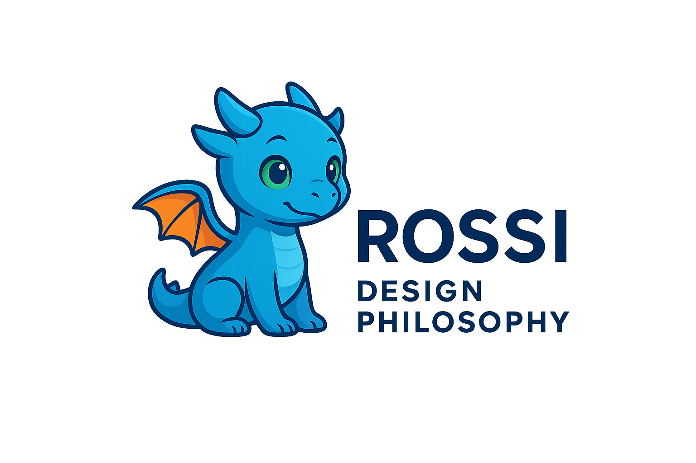

# Rossi Design Philosophy

Welcome to the **Rossi Design Philosophy (RDP)** repository! The RDP is a systematic methodology for developing R dataset packages that enhances usability, transparency, and discoverability. Created by Renzo Caceres Rossi, this philosophy addresses challenges in the R ecosystem, such as inconsistent naming conventions and lack of clarity in dataset structures, through standardized principles and practices.

Our primary goal is the **widespread adoption of the RDP** to improve dataset package development in the R ecosystem. The methodology is licensed under **CC BY 4.0**, allowing you to use, share, adapt, and remix it freely for any purpose, including commercial and educational uses.

[Read the full methodology in docs/ROSSI_DESIGN_PHILOSOPHY.md](docs/ROSSI_DESIGN_PHILOSOPHY.md)

---

## Overview

The Rossi Design Philosophy provides a framework for creating professional, user-friendly R dataset packages. It is built on four core principles:

1. **Structural Transparency**: Dataset names use standardized suffixes (e.g., `_df`, `_tbl_df`) to indicate their R object type.
2. **Predictive Consistency**: Follows a uniform naming pattern (`dataset_name_object_suffix`) for predictability.
3. **Enhanced Discoverability**: Includes a `view_datasets_PackageName()` function for easy exploration of package datasets.
4. **User-Centric Documentation**: Explicitly states object types in dataset names and documentation.

The RDP has been successfully implemented in over 20 CRAN packages, such as [SouthKoreAPIs](https://lightbluetitan.github.io/southkoreapis/) and [NeuroDataSets](https://lightbluetitan.github.io/neurodatasets/), and is currently being taught in the ["Desarrollo de Paquetes en R" course](#course-details) at Universidad de Piura (August 23 - September 20, 2025).

---

## Licensing and Attribution

The Rossi Design Philosophy is licensed under **Creative Commons Attribution 4.0 International (CC BY 4.0)**. You are free to use, adapt, and share this methodology without restrictions.

**Attribution**: We encourage you to credit Renzo Caceres Rossi as the creator when using or adapting the RDP, but this is **entirely optional**. Suggested citation:  
Caceres Rossi, R. (2025). The Rossi Design Philosophy: A Systematic Methodology for R Dataset Packages.

- **Optional Attribution File**: Including a [`templates/METHODOLOGY.md` template](templates/METHODOLOGY.md) in the root of your package to document adherence to the RDP is encouraged but **not required**.
- **Optional DESCRIPTION Note**: You may include attribution in the `DESCRIPTION` file (e.g., "This package follows the Rossi Design Philosophy, Caceres Rossi, 2025"), but this is also **not required**.
- **Our Goal**: We prioritize the adoption of the RDP to enhance the R ecosystem. If you choose not to include attribution, there is no issue—just apply the philosophy to create high-quality dataset packages!

---

## Getting Started

To implement the Rossi Design Philosophy in your R package:
1. Read the full methodology in [docs/ROSSI_DESIGN_PHILOSOPHY.md](docs/ROSSI_DESIGN_PHILOSOPHY.md).
2. Apply the [core principles](#core-principles) and [suffix taxonomy](#suffix-taxonomy).
3. Use the provided templates in [templates/](templates/) for the `view_datasets_PackageName()` function and documentation (see [Appendices](docs/ROSSI_DESIGN_PHILOSOPHY.md#appendices)).
4. Optionally include a `METHODOLOGY.md` file using the [provided template](templates/METHODOLOGY.md) to document your adherence to the RDP.

For examples, explore the [examples/ folder](examples/) or CRAN packages like [SouthKoreAPIs](https://lightbluetitan.github.io/southkoreapis/) or [ArgentinAPI](https://lightbluetitan.github.io/argentinapi/).

---

## Course Details

The RDP is being taught in the **"Desarrollo de Paquetes (Packages) en R"** course offered by the IEEE EMBS chapter at Universidad de Piura (August 23 - September 20, 2025).

- **Instructor**: Renzo Caceres Rossi (R Specialist, Data Science Research Peru mentor, IEEE and LatinR speaker)
- **Duration**: 4 weeks (Saturdays and Sundays, 4:00 - 6:00 PM GMT-5)
- **Participants**: Students from Peru and Colombia
- **Outcomes**: Students develop and publish professional R packages on CRAN following the RDP.

In the course, students are encouraged to include a `METHODOLOGY.md` file for academic recognition (see [course/](#course-details)), but this is **not required** outside the course context or in general use.

---

## Contributing

We welcome contributions to refine and expand the Rossi Design Philosophy! To contribute:
- Submit suggestions, new suffixes, or case studies via [GitHub Issues](https://github.com/lightbluetitan/rossi-design-philosophy/issues).
- Share your RDP-compliant packages or feedback through the repository.

See [Contact and Contributions](docs/ROSSI_DESIGN_PHILOSOPHY.md#contact-and-contributions) for details.

---

## Resources

- **Full Methodology**: [docs/ROSSI_DESIGN_PHILOSOPHY.md](docs/ROSSI_DESIGN_PHILOSOPHY.md)
- **Attribution Template**: [templates/METHODOLOGY.md](templates/METHODOLOGY.md)
- **Examples**: [examples/](examples/)
- **Course Materials**: [course/](course/)
- **License**: [LICENSE.md](LICENSE.md) (CC BY 4.0)
- **Repository**: https://github.com/lightbluetitan/rossi-design-philosophy
- **Contact**: Renzo Caceres Rossi (arenzocaceresrossi@gmail.com)

---

**Version**: 1.0  
**Last Updated**: August 2025  
**Status**: Active development and community adoption